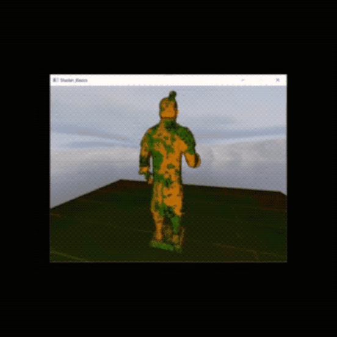

# CW1_GLSL
 
Visual Studio 2019 and Operating System windows 10

----------------------------------------------------------
How to use
----------------------------------------------------------

the exucutable is a prototype to show off my knolage of GLSL 

when the exucutabl is run you are placed in a scene with a statue in the midles of it.

you can use WASD to  move afound the scene and the mouse to roate

----------------------------------------------------------
 how does it work / how does the code fit together
----------------------------------------------------------

The code starts off by initiating the modles that are being used by the scne in this case a staue and a plane(square)

in the initScene() function all of the textures are loaded in and all of the light intensitys that the shaders needed to create the light is set.

in the scene there are a totale of 4 point lights scatterd around the statue and a main directs light(spot light) pointing onto it.

in the program there are 2 shaders each made of a vertex shader and a fragement shader.

the first shader and the mostimportant is the basic_uniform.vert and basic_uniform.frag as these are used to create the lights using a blinn_phong approach as well as mapp the texytures to the modles used in the scene

 
